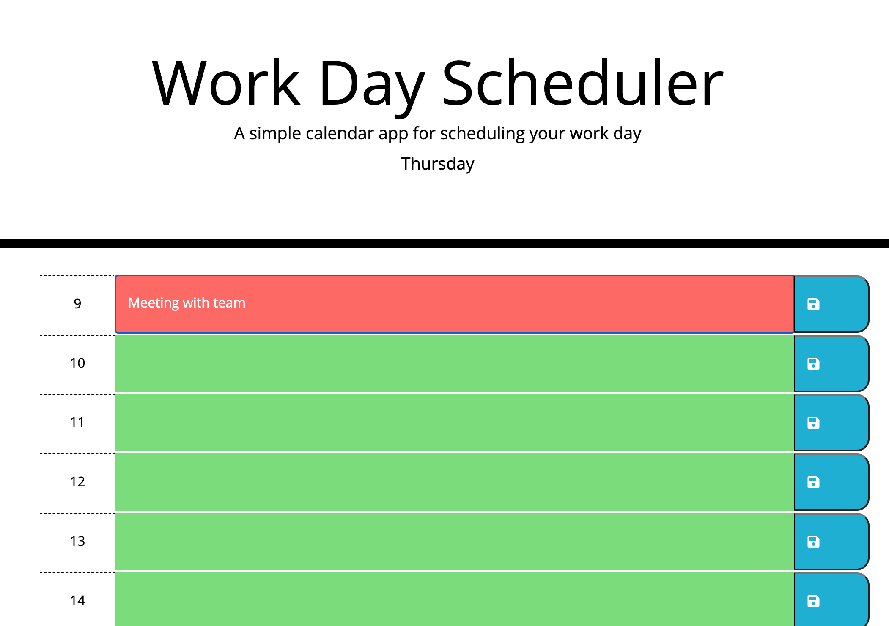
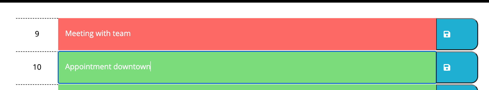

# Work Day Scheduler

## Description

This webpage is a work day scheduler. It has time blocks for each business hour that you can edit and save. The time blocks are color-coded depending on the current time.
- I created this project to improve my jQuery, Bootstrap and web development skills while creating a useful tool.
- This project helps schedule your work day into hourly chunks.
- This project provides an easy way to organize your time.
- I learned more about jQuery, Bootstrap, and JavaScript through this project.

## Installation

- Open your browser.
- Copy and paste URL: http://ericaemorabito.github.io/Work_Day_Scheduler

## Usage
- In order to edit your schedule, click the empty row and type.
- Click the save icon on the right of the hour you updated to save changes.
